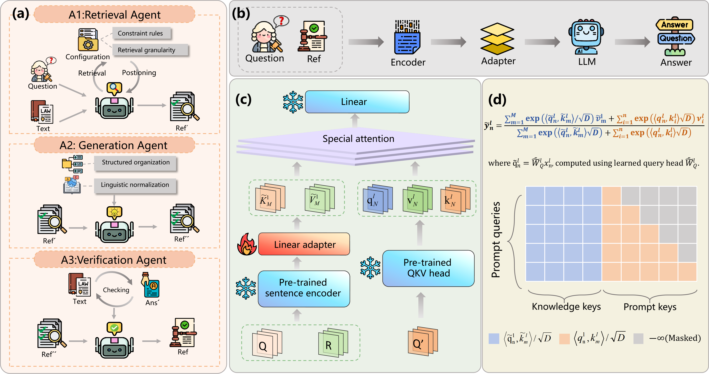

# LKIF (Legal Knowledge Injection and Fusion)

[](https://opensource.org/licenses/MIT)

## Table of Contents

- 🌟[Overview](#overview)
- 🔧[Installation](#installation)
- 📚[Project Structure](#project-structure)
- 🎯[Usage](#usage)
  - [Training](#training)
  - [Evaluation](#evaluation)
- 📖[Documentation](#documentation)
- 🚩[Citation](#citation)

---

## 🌟Overview

Large Language Models (LLMs) hold great application potential in legal scenarios, yet they are hindered by issues such as hallucinations, unstable reasoning, and unverifiable evidence, making it difficult to meet the requirements of high rigor. Although vanilla RAG provides external factual support, it is susceptible to retrieval noise interference in scenarios involving highly similar legal corpora and long legal documents, which leads to failure in evidence selection and reasoning alignment. To address these problems, we proposes the Legal Multi-Component Enhanced RAG Framework (LMCE-RAG). It constructs traceable, high-quality reference information via the Legal Multi-Agent Collaboration Mechanism (LMAC), and integrates the Legal Knowledge Injection and Fusion Mechanism (LKIF) to directly incorporate external evidence into the reasoning process, thereby improving both reliability and efficiency. Experiments based on Llama3 models demonstrate that this method outperforms baseline approaches under both regular and long-complex settings, and exhibits stronger robustness in complex legal reasoning tasks.

**Key Features:**
- Knowledge encoder with multi-layer projection support
- Integration with LLaMA, Qwen, and Phi3 models
- BM25-based snippet selection for efficient retrieval
- Azure OpenAI integration for embeddings
- Comprehensive training and evaluation pipelines

## 🔧Installation

### Prerequisites
- Python 3.9+
- CUDA 11.8+ (optional, for GPU support)

### Setup

```bash
# Clone or download the repository
cd LMCE-RAG

# Install dependencies
pip install -r requirements.txt
```

### Core Dependencies
- **PyTorch**: Deep learning framework
- **Transformers**: Hugging Face model implementations
- **Sentence Transformers**: Embedding models
- **NumPy**: Numerical computing
- **Azure Identity**: Credential management
- **OpenAI**: LLM API client

## 📚Project Structure

```
.
├── src/
│   ├── LMCE-RAG/                      # Core LKIF package
│   │   ├── models/
│   │   │   ├── LMCE-RAG_config.py     # Configuration (LKIFConfig)
│   │   │   ├── LMCE-RAG_processor.py  # Processor (LKIFProcessor)
│   │   │   ├── llama3_model.py     # LLaMA integration
│   │   │   ├── phi3_model.py       # Phi3 integration
│   │   │   └── Qwen_modle.py       # Qwen integration
│   │   ├── snippet_selector/       # BM25-based selection
│   │   ├── utils/                  # Helper utilities
│   │   ├── kb_encoder.py           # LKIF encoder
│   │   └── gpt_session.py          # Azure OpenAI management
│   └── lkif/                       # Compatibility shim
├── experiments/                    # Training and evaluation
│   ├── train.py
│   ├── eval.py
│   ├── eval_rag_datasets.py
│   └── rag.py
├── date-synthesis copy/            # Data synthesis utilities
├── train.sh                        # Main training script
├── eval_*.sh                       # Evaluation scripts
├── requirements.txt                # Dependencies
└── README.md                       # This file
```

### Package Naming

The codebase uses `LMCE-RAG` internally (for backward compatibility) but provides a `lkif` compatibility shim at `src/lkif/__init__.py`. You can import using either:

```python
from LMCE-RAG.kb_encoder import LKIFEncoder
# or
from lkif.kb_encoder import LKIFEncoder  # via shim
```

## 🎯Usage

### Training

Run the unified training pipeline:

```bash
bash train.sh
```

This executes:
```bash
python experiments/train.py \
  --dataset_dir /path/to/lkif/date-synthesis/qar_generation/results \
  --train_dataset QA-summary \
  --N 16814 \
  --B 4 \
  --gradient_accm_step 10 \
  --total_steps 9001 \
  --encoder_spec bge-large-en-v1.5 \
  --key_embd_src key \
  --use_data_aug \
  --use_cached_embd \
  --sep_query_head \
  --kb_token_layer_frequency 3 \
  --llm_type llama3 \
  --hf_model_spec /path/to/lkif/Llama-3.2-1B-Instruct \
  --model_save_dir /path/to/lkif/model-save
```

**Key Parameters:**
- `--dataset_dir`: Directory containing training data
- `--encoder_spec`: Embedding model specification
- `--llm_type`: Target language model (llama3, qwen, phi3)
- `--use_cached_embd`: Use pre-computed embeddings
- `--sep_query_head`: Use separate query head for KB attention

### Evaluation

**Standard Evaluation:**
```bash
bash eval_standard.sh
```

**RAG Dataset Evaluation:**
```bash
bash eval_rag_datasets.sh
```

**Generation Evaluation:**
```bash
bash eval_generation.sh
```

**Knowledge Base Embeddings:**
```bash
bash kb_embeddings.sh
```

## 📖Documentation

### Core Components

**LKIFEncoder** (`src/LMCE-RAG/kb_encoder.py`)
- Encodes knowledge base entries into embeddings
- Supports local models (SentenceTransformer) or cloud APIs (Azure OpenAI)
- Projects embeddings via configurable projector (identity, linear, MLP)

**LKIFProcessor** (`src/LMCE-RAG/models/LMCE-RAG_processor.py`)
- Integrates tokenization and encoding
- Prepares batch data for model training/inference
- Combines text inputs with knowledge embeddings

**LKIFConfig** (`src/LMCE-RAG/models/LMCE-RAG_config.py`)
- Configuration class for knowledge injection parameters
- `kb_layer_frequency`: Injection frequency across model layers
- `sep_query_head`: Use separate query projection for KB attention
- `dynamic_sparsify`: Prune low-attention KB entries

**Model Variants**
- `LkifLlamaAttention`: LLaMA integration
- `LKIFQwen2Attention`: Qwen integration
- Custom attention mechanisms for knowledge fusion

### Authentication

The package uses Azure credential system:
- Local credential cache: `auth_record.json` (added to .gitignore)
- Device code authentication supported
- Set `AZURE_OPENAI_ENDPOINT` and `AZURE_OPENAI_KEY` environment variables

### Configuration

Model configuration is managed via `LKIFConfig`:

```python
from LMCE-RAG.models.LMCE-RAG_config import LKIFConfig

config = LKIFConfig(
    base_model_name_or_path="meta-llama/Llama-3.2-1B-Instruct",
    lkif_layer_frequency=3,
    sep_query_head=True,
    dynamic_sparsify=False,
    top_k_lkif=100
)
```

## 🚩Citation

If you use this framework in your research, please cite:

---

## Contributing

We maintain this repository actively and welcome contributions. If you encounter issues or have suggestions, please open an issue on the repository.

## License

This project is licensed under the MIT License - see the LICENSE file for details.
